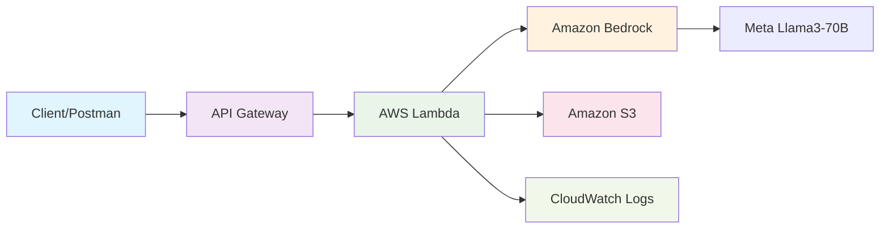

# AI Blog Generator with AWS Bedrock


> A production-ready serverless application that generates high-quality blog content using AWS services and Amazon Bedrock's Meta Llama3-70B model.

## 📖 Table of Contents

- [Overview](#overview)
- [Architecture](#architecture)
- [Features](#features)
- [Technology Stack](#technology-stack)
- [Prerequisites](#prerequisites)
- [Installation & Setup](#installation--setup)
- [Usage](#usage)
- [API Reference](#api-reference)
- [Configuration](#configuration)
- [Monitoring & Logging](#monitoring--logging)
- [Contributing](#contributing)
- [License](#license)
- [Contact](#contact)

## 🎯 Overview

The **AI Blog Generator** is an end-to-end serverless solution that leverages the power of generative AI to create professional blog content. Built with AWS cloud services, this application demonstrates modern serverless architecture patterns while providing practical AI-powered content generation capabilities.

### Key Highlights
- ⚡ **Serverless Architecture**: Fully managed AWS services with auto-scaling
- 🤖 **AI-Powered**: Meta Llama3-70B model via Amazon Bedrock
- 🔄 **End-to-End Automation**: From API request to content storage
- 📊 **Production Ready**: Comprehensive logging and monitoring
- 🚀 **High Performance**: Optimized with custom Lambda layers

## 🏗️ Architecture



### System Flow
1. **API Request**: Client sends blog topic via REST API
2. **Lambda Processing**: Custom function processes the request
3. **AI Generation**: Amazon Bedrock generates content using Meta Llama3-70B
4. **Storage**: Generated blog automatically saved to S3 with timestamp
5. **Monitoring**: Complete workflow tracked in CloudWatch

## ✨ Features

- 🎨 **Intelligent Content Creation**: Generate contextually relevant blog posts
- 🔗 **RESTful API**: Clean, documented endpoints for easy integration
- 💾 **Automatic Storage**: Timestamped content saved to S3
- 📈 **Scalable**: Serverless architecture handles varying loads
- 🔍 **Comprehensive Logging**: Full request/response tracking
- ⚙️ **Custom Runtime**: Optimized Lambda layers for performance
- 🛡️ **Secure**: IAM-based access control and encryption

## 🛠️ Technology Stack

| Category | Technology |
|----------|------------|
| **Language** | Python 3.9 |
| **Cloud Provider** | Amazon Web Services (AWS) |
| **AI/ML** | Amazon Bedrock, Meta Llama3-70B |
| **Compute** | AWS Lambda (Custom Layers) |
| **API** | AWS API Gateway |
| **Storage** | Amazon S3 |
| **Monitoring** | CloudWatch Logs |
| **SDK** | boto3 |

## 📋 Prerequisites

Before setting up the project, ensure you have:

- ✅ AWS Account with appropriate IAM permissions
- ✅ AWS CLI installed and configured
- ✅ Python 3.9 or higher
- ✅ Access to Amazon Bedrock service
- ✅ Basic knowledge of AWS services

### Required AWS Permissions
```json
{
    "Version": "2012-10-17",
    "Statement": [
        {
            "Effect": "Allow",
            "Action": [
                "bedrock:InvokeModel",
                "s3:PutObject",
                "s3:GetObject",
                "lambda:InvokeFunction",
                "logs:CreateLogGroup",
                "logs:CreateLogStream",
                "logs:PutLogEvents"
            ],
            "Resource": "*"
        }
    ]
}
```

## 🚀 Installation & Setup

### 1. Clone Repository
```bash
git clone https://github.com/eensaydn/ai-blog-generator.git
cd ai-blog-generator
```

### 2. Create S3 Bucket
```bash
aws s3 mb s3://your-unique-blog-bucket-name --region us-east-1
```

### 3. Set Up Lambda Function

#### Create deployment package:
```bash
# Install dependencies
pip install boto3 -t ./package/
cd package
zip -r ../lambda-function.zip .
cd ..
zip -g lambda-function.zip lambda_function.py
```

#### Deploy Lambda:
```bash
aws lambda create-function \
    --function-name blog-generator \
    --runtime python3.9 \
    --role arn:aws:iam::YOUR-ACCOUNT:role/lambda-execution-role \
    --handler lambda_function.lambda_handler \
    --zip-file fileb://lambda-function.zip \
    --environment Variables='{BUCKET_NAME=your-unique-blog-bucket-name}'
```

### 4. Configure API Gateway
```bash
# Create REST API
aws apigateway create-rest-api --name blog-generator-api

# Configure POST method and Lambda integration
# Deploy to stage
```

## 📖 Usage

### Basic API Call

**Endpoint**: `POST https://your-api-gateway-url/prod/generate`

**Request:**
```bash
curl -X POST https://your-api-gateway-url/prod/generate \
  -H "Content-Type: application/json" \
  -d '{
    "blog_topic": "The Future of Artificial Intelligence in Healthcare"
  }'
```

**Response:**
```json
{
    "statusCode": 200,
    "body": "Blog Generation is completed"
}
```

### Using Postman
1. Set method to `POST`
2. Enter your API Gateway URL
3. Add JSON body with `blog_topic` parameter
4. Send request
5. Check S3 bucket for generated content

## 📚 API Reference

### Generate Blog Content

| Parameter | Type | Required | Description |
|-----------|------|----------|-------------|
| `blog_topic` | string | Yes | Topic for blog generation (max 200 chars) |

**Example Topics:**
- "Machine Learning in Healthcare"
- "Sustainable Energy Solutions"
- "Remote Work Best Practices"

### Response Format
- **Success**: HTTP 200 with confirmation message
- **Error**: HTTP 500 with error details
- **Generated Content**: Saved to S3 as `blog-output/{timestamp}.txt`

## ⚙️ Configuration

### Environment Variables

| Variable | Description | Default |
|----------|-------------|---------|
| `BUCKET_NAME` | S3 bucket for content storage | `aws_bedrock_course1` |
| `AWS_REGION` | AWS region for services | `us-east-2` |
| `MODEL_ID` | Bedrock model identifier | `meta.llama3-70b-instruct-v1:0` |

### Lambda Configuration
```python
# Recommended settings
MEMORY_SIZE = 512  # MB
TIMEOUT = 30       # seconds
RUNTIME = "python3.9"
```

## 📊 Monitoring & Logging

### CloudWatch Integration
- **Lambda Logs**: Function execution details
- **API Gateway Logs**: Request/response tracking  
- **Error Monitoring**: Automatic error detection
- **Performance Metrics**: Execution time and memory usage

### Log Analysis
```bash
# View recent logs
aws logs describe-log-streams --log-group-name /aws/lambda/blog-generator

# Filter specific events
aws logs filter-log-events --log-group-name /aws/lambda/blog-generator \
  --filter-pattern "ERROR"
```

## 🔒 Security Best Practices

- ✅ Use least privilege IAM roles
- ✅ Enable API Gateway authentication
- ✅ Encrypt S3 buckets
- ✅ Implement request rate limiting
- ✅ Regular security audits

## 🤝 Contributing

Contributions are welcome! Please follow these steps:

1. **Fork** the repository
2. **Create** a feature branch (`git checkout -b feature/amazing-feature`)
3. **Commit** your changes (`git commit -m 'Add amazing feature'`)
4. **Push** to the branch (`git push origin feature/amazing-feature`)
5. **Open** a Pull Request

### Development Guidelines
- Follow PEP 8 Python style guide
- Add unit tests for new features
- Update documentation as needed
- Test locally before submitting PR

## 📄 License

This project is licensed under the **MIT License** - see the [LICENSE](LICENSE) file for details.

## 📞 Contact

**Enes Aydın**
- 🐙 GitHub: [@eensaydn](https://github.com/eensaydn)
- 💼 LinkedIn: [enesaydin00](https://www.linkedin.com/in/enesaydin00)
- 📧 Email: [Contact via LinkedIn](https://www.linkedin.com/in/enesaydin00)

---

<div align="center">

### 🌟 Star this repository if you found it helpful!

**Built with ❤️ using AWS Serverless Technologies**


</div>
